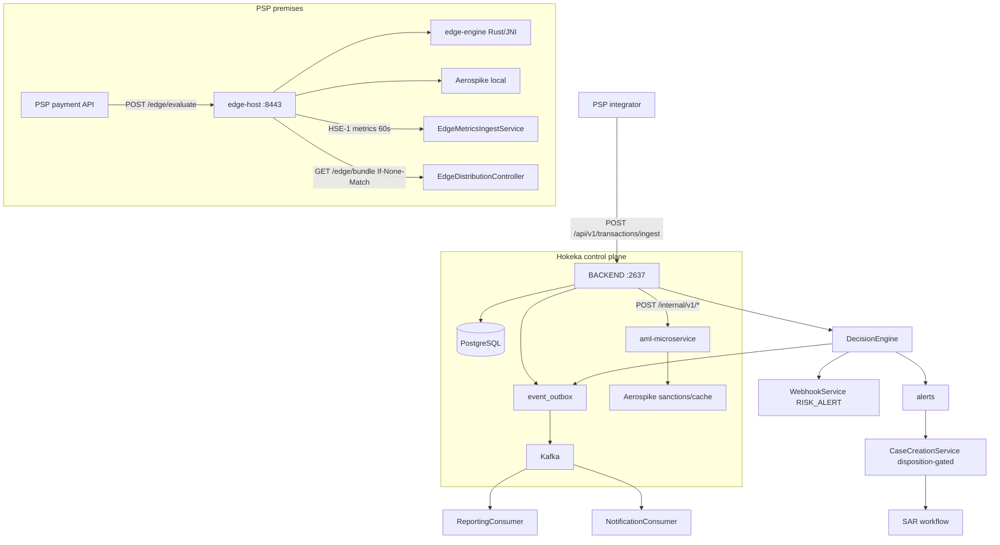
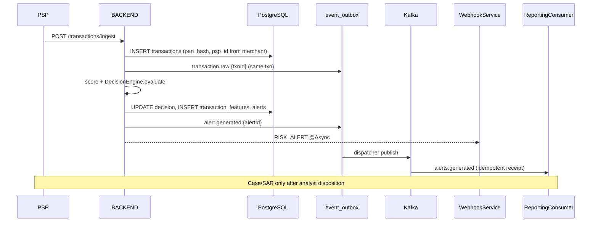

# System Communication & Transaction Path Analysis

_Evidence-based engineering briefing for Hokeka AML. Compiled 2026-09-18 against commit `909c8c54a` (`feat: on-prem leases, entitlements, rules hardening, and edge ops UI`). Four independent passes; a short synthesis follows._

**Method:** Each pass re-reads primary sources (TODO waves 59–67, gap register, architecture docs, live Java/Rust/TypeScript) and cites `file:line` or route/class names. Where source and stale docs conflict, **current source wins** (Wave 59: later waves are authoritative). Items marked **COULD-NOT-VERIFY** lack conclusive evidence in this audit.

---

## Pass A — Pending vs Supposed-to-Be-Implemented

### A.1 Method

1. Re-read `TODO.md` waves 59–67 (top ~400 lines), `docs/AML-FRAUD-COVERAGE-GAP-REGISTER.md`, `docs/features/README.md`, `docs/architecture/*`, `docs/architecture/onprem-service-auth.md`, `docs/PSP_API_GUIDE.md` (webhook section).
2. Grep and trace communication/reaction surfaces in `BACKEND/`, `FRONTEND/`, `edge-host/`, `aml-microservice/`.
3. Classify each capability: **SHIPPED**, **PARTIAL**, **PENDING LARGE**, **NEEDS-DECISION**, **ORPHANED/DEAD**.
4. Cross-check gap-register rows against live callers (several rows are now stale — noted below).

### A.2 Wave 59–67 backlog (re-verified at tip)

| Bucket | Items | Notes |
|--------|-------|-------|
| **LARGE (6)** | W47, W45, W29-2, W35-1, W20-17, W18-7 | Unchanged intent per `TODO.md:15-21` |
| **NEEDS-DECISION (~13)** | W19-1/W20-5, W49-8, W49-11, W18-6, W20-2, W20-10/W33-2, W27-4, W26-7, W34-1, + 5 infra-only Wave 57 | `TODO.md:381-400` |
| **Closed since Wave 67 text** | W26-8 (webhooks UI), W36-4 (PSP API reconciliation), W21-7 (travel-rule jurisdiction) | W26-8/W36-4: `TODO.md:5-13`; W21-7: `MultiAssetRiskEngine.java:59-69`, test `MultiAssetRiskEngineTravelRuleJurisdictionTest.java` |

**SMALL queue:** Exhausted at Wave 66 (`TODO.md:62-66`).

### A.3 Capability matrix (communication & reaction focus)

| Capability | Status | Evidence | Why it matters |
|------------|--------|----------|----------------|
| **Webhook subscribe/list/delete** | SHIPPED | `WebhookSubscriptionController` `/webhooks` — `POST /subscribe` (:51), `GET /subscriptions` (:83), `DELETE /subscriptions/{id}` (:100) | PSP async reaction channel |
| **Webhook HMAC delivery** | SHIPPED | `WebhookService.sendWebhook` (:71), `X-Hokeka-Signature` (:147) | Authenticated outbound events |
| **`RISK_ALERT` webhook trigger** | SHIPPED | `DecisionEngine.publishAlertGeneratedEvent` → `webhookService.sendWebhook(..., "RISK_ALERT", ...)` (:531), isolated try/catch (:524-536) | Only live txn-path webhook today |
| **`CASE_UPDATE` webhook** | PENDING LARGE | Valid in `WebhookSubscriptionController:32-33`; **zero producers** in `BACKEND/src` | Subscriptions silently never fire |
| **`MERCHANT_STATUS_CHANGE` webhook** | PENDING LARGE | Same; status changes exist (`PspService.reactivateIfDuesCleared`, `MpesaService:287`) but no webhook | Lifecycle invisible to integrators |
| **Webhook durability** | PARTIAL | `@Async` fire-and-forget; 5 failures → auto-disable (`WebhookService:129-138`); no outbox/retry/DLQ | Lossy vs Kafka outbox path |
| **Webhooks Settings UI** | SHIPPED | `FRONTEND/.../Settings/tabs/WebhooksTab.tsx`; states only `RISK_ALERT` delivered | Self-service |
| **Transactional Kafka outbox** | SHIPPED | `KafkaOutboxDispatcher` `@Scheduled` (:39), `FOR UPDATE SKIP LOCKED`, ack wait | Durable internal fan-out |
| **Alert → outbox** | SHIPPED | `DecisionEngine:517` → `TOPIC_ALERTS_GENERATED` | Downstream reporting/notifications |
| **Case → outbox** | SHIPPED | `CaseEventProducer:51,:80`; callers `CaseCreationService`, `CaseDecisionService` | Case lifecycle events |
| **Kafka → email consumer** | SHIPPED (gated) | `NotificationConsumer:29,:39` → `EmailNotificationService` | Human notification path |
| **SMTP email** | SHIPPED, **OFF default** | `notifications.email-enabled=false` (`application.properties:346`) | SAR/dunning/password-reset degrade to logs |
| **Slack alerts** | SHIPPED, **OFF default** | `slack.enabled=false` (`application.properties:333`) | Ops alerting |
| **Billing email / dunning** | SHIPPED (gated) | `BillingEmailService`, `DunningScheduler`, `PspAdminBillingController POST .../notify` | Revenue/compliance comms |
| **In-app messages API** | SHIPPED | `MessagesController` `/messages`; producers `CaseSlaService`, `TriggerBasedKycService` | Operator notifications |
| **In-app messages UI** | PARTIAL / ORPHANED | Bell button no `onClick` (`HokekaHeader.tsx:65-76`); `unread/count`, `read-all` uncalled from SPA | Messages exist but no ambient UX |
| **M-Pesa Daraja callback** | SHIPPED | `PaymentController` `POST /billing/payments/mpesa/callback` (:254); secret + constant-time compare | Inbound payment comms |
| **M-Pesa idempotency / under-pay** | SHIPPED (TODO stale) | `MpesaService.processCallback:234-284` | Prevents double-settle; `TODO.md` C2 still unchecked |
| **Verifi/RDR inbound webhooks** | SHIPPED | `VerifiRdrController`, `VerifiDecisionController`, etc. | Chargeback ingest |
| **SAR/STR regulator transports** | SHIPPED (per-regulator gate) | `RegulatorySubmissionService:55`; disabled → `SUBMISSION_PENDING` | Outbound regulatory comms |
| **CBK GDI submissions** | SHIPPED, **OFF default** | `cbk.enabled=false`, `cbk.allow-live=false` (`application.properties:479,:486`) | Kenya regulator channel |
| **Edge enroll/bundle/metrics** | SHIPPED | `EdgeDistributionController` `/edge` — enroll (:106), bundle (:140), metrics (:195); contract `docs/architecture/edge-channel-contract.md` §5 | Control-plane ↔ edge channel |
| **Edge admin + FRONTEND** | SHIPPED | `EdgeAdminController`; `FRONTEND/.../EdgeNodes/edgeApi.ts` | Ops lifecycle |
| **On-prem lease issue/renew** | SHIPPED | `OnPremAuthController` `/onprem/auth`; `OnPremLeaseService`; `V209__onprem_service_leases.sql` | SaaS licensing channel |
| **On-prem fail-closed gate** | SHIPPED | `OnPremLeaseGateFilter:111` → 503 `SERVICE_AUTHORIZATION_STOPPED`; `OnPremServiceGate` starts STOPPED | Blocks ingest when unlicensed |
| **On-prem admin UI** | ORPHANED | `OnPremInstanceAdminController` `/admin/onprem/instances`; **zero** `onprem` hits in `FRONTEND/src` | Admin API curl-only |
| **Rate limit / quota reaction** | SHIPPED | `RateLimitingFilter:61,:69` → 429; `EntitlementController GET /entitlements/me` | Tenant-facing backpressure |
| **PSP suspension gate** | SHIPPED | `PspActivationFilter:138` → 403 | Hard stop for suspended PSPs |
| **Batch settled-txn → DecisionEngine** | SHIPPED (gap register stale) | `BatchScoringService:95` `decisionEngine.evaluate(...)` | Post-settlement alerts; gap register §3 still says otherwise |
| **AmlDetection funnel/TBML** | SHIPPED (gap register stale) | `AmlDetectionController:60,:70` | Reachable detectors; gap register §5 stale |
| **Neo4j graph analytics** | PARTIAL | Callers exist (`CaseEnrichmentService`, `FeatureExtractionService`); `neo4j.enabled=false` (`application.properties:144`); no `/network` controller | Inert by default |
| **CTR auto-filing bridge** | PENDING LARGE | Gap register §6; no scheduled detection→filing in `FrcReportingService` | Manual CTR pull |
| **W47 AeroORM cutover** | PENDING LARGE | `TODO.md:16-17` | Microservice cache path |
| **W45 settlement-hash linkage** | PENDING LARGE | `TODO.md:17-18` | KYB crypto design |
| **W29-2 OCR/IDV** | PENDING LARGE | Manual verify only; `sumsub.enabled=false` | KYC automation |
| **W35-1 DB tenant isolation** | PENDING LARGE | App-code only; no Hibernate `@Filter`/RLS | Defense-in-depth |
| **W20-17 global search** | PENDING LARGE | No backend search endpoint; dead frontend removed Wave 62 | Cross-entity discovery |
| **W18-7 SANCTIONS/CYBER signals** | PENDING LARGE | Enum values never produced (`TODO.md:201`) | Signal taxonomy wiring |
| **VGS tokenization** | ORPHANED/STUB | `AppConfig.vgsProxiedRestTemplate` plain `RestTemplate` (:23-33); `vgs.proxy.enabled=false` | No live tokenization |
| **`sendComplianceReportCallback`** | ORPHANED | `NotificationService:110` — zero callers; logs only | Dead merchant callback |
| **`BehavioralAnalyticsService`** | ORPHANED | No callers outside self + comment in `MerchantRepository:246` | Peer-group analytics unreachable |
| **Notification bell** | DEAD UI | `HokekaHeader.tsx:65-76` | Longstanding UX gap |

### A.4 Documented-but-unreachable (orphaned API surfaces)

| Surface | Status | Evidence |
|---------|--------|----------|
| `GET /messages/unread/count`, `PUT /messages/read-all` | ORPHANED routes | `MessagesController:51,:60`; no FRONTEND caller |
| `GET /grafana/dashboards` | ORPHANED | `GrafanaUserContextController:92`; SPA uses iframe URL instead |
| `/clients`, `/feedback`, `/stats`, `/http2`, `/underwriting/merchants`, `/risk/customer` | COULD-NOT-VERIFY intent | Controllers exist; no feature doc or SPA wiring found |
| `/aml/detection`, `/transaction/result` | SHIPPED (API-only) | Documented in `DECISION_AND_MODEL_EVIDENCE.md`, `BILLING_PRICING.md` |

### A.5 Documentation drift (communication-specific)

| Doc | Issue | Authoritative source |
|-----|-------|-------------------|
| `docs/features/API_INTEGRATION.md:220-242` | Aspirational 8-event webhook API | `PSP_API_GUIDE.md:660-703`, `WebhookSubscriptionController:32-33` |
| `docs/features/NOTIFICATIONS.md:72-99` | Wrong webhook payload/shape | `DecisionEngine:500-512` |
| `docs/AML-FRAUD-COVERAGE-GAP-REGISTER.md` §3, §5 | Batch→DecisionEngine, funnel/TBML orphans | Live code (see matrix) |
| `docs/architecture/onprem-service-auth.md` §Admin | No note that admin UI is absent | `OnPremInstanceAdminController` only |

### A.6 Pass A conclusion

Communication **reaction plumbing is asymmetric**: Kafka/outbox paths are durable; **webhooks are the only PSP-facing async channel on the txn path and they are lossy**. Two of three subscribable webhook events never fire. Human channels (email, Slack, in-app) are largely **off by default** or **half-wired in the UI**. Edge and on-prem lease channels are **shipped and fail-closed**; on-prem **administration lacks a UI**.

---

## Pass B — How Everything Works Together (Integration Map)

### B.1 Method

Trace request paths, HTTP contracts, Kafka topics, and HSE/mTLS layering from controllers through services to external systems. Compare architecture docs to implementation; flag fail-open vs fail-closed explicitly.

### B.2 Deployment modes (three, not two)

| Mode | Components | Transaction scoring | Licensing |
|------|------------|---------------------|-----------|
| **SaaS control plane** | `BACKEND` :2637, Postgres, Kafka, optional Neo4j | Full pipeline → alerts/cases/SAR | `hokeka.auth.enabled=false` (default) |
| **On-prem full BACKEND** | Same artifact, local infra | Same as SaaS | `OnPremLeaseGateFilter` — 503 when STOPPED |
| **On-prem edge** | `edge-host` :8443 + `edge-engine` (Rust JNI) + local Aerospike | Local rules only; **no cloud txn row** | `ActivationService` + HSE activation envelope |

### B.3 Integration diagram (live architecture)

### B.4 Path A — Edge evaluate (pre-auth intended)

| Step | Component | Contract / behaviour | Evidence |
|------|-----------|---------------------|----------|
| 1 | TLS 1.3 only | Refuses cleartext | `EdgeTlsGuard.java:62-101` |
| 2 | Authorization gate | HOLD if not active (non-dev) | `EdgeEngine.java:248-252`, `ActivationService.java:69-80` |
| 3 | Feature enrich | Local Aerospike; caller features override | `EdgeController.java:75-81` |
| 4 | Evaluate | Rust native → Java standby on fault | `EdgeEngine.java:247-277`, JNI `edge-jni/src/lib.rs` |
| 5 | Record post-eval | Velocity cannot self-inflate | `EdgeController.java:80-81` |
| 6 | Metrics | Aggregate only, HSE-1 sealed | `MetricsShipper.java:22-28`, `EdgeMetricsIngestService.java:46-62` |

**Bundle sync:** `EdgeBundleDistributionService.sealFor` compiles PSP rules → HSE-1 → `GET /api/v1/edge/bundle` (`edge-channel-contract.md` §5). Zero-rule bundles refused (`EdgeBundleDistributionService.java:96-105`). ETag advances only on live publish (`RuleBundlePoller.java:147-162`).

### B.5 Path B — Control-plane ingest (post-auth / case management)

| Step | Endpoint / service | Evidence |
|------|-------------------|----------|
| Admission | Rate limit + concurrency cap | `TransactionController.java:114-143` |
| Persist | `TransactionIngestionService.ingestTransaction` | `TransactionController.java:125` |
| Outbox | `transaction.raw:{txnId}` → `transactions.raw` | `TransactionIngestionService.java:183-187` |
| Orchestrate | `FraudDetectionOrchestrator` / async variant | `FraudDetectionOrchestrator.java:53-65` |
| Decide | `DecisionEngine.evaluate` | `DecisionEngine.java:96-171` |
| Fan-out | Outbox + webhook + alert row | `DecisionEngine.java:516-536` |

Default ingest is **async-enabled** (`TransactionController.java:151`) — work moves off Tomcat thread but client still awaits `CompletableFuture`.

### B.6 BACKEND ↔ aml-microservice

| Client | Route | Circuit breaker | Fallback |
|--------|-------|-----------------|----------|
| `AmlMicroserviceClient` | `POST /internal/v1/aml/score`, cache GET/PUT | `amlMicroservice` | `null` → local pipeline |
| `SanctionsScreenClient` | `POST /internal/v1/sanctions/screen` | **`sanctionsScreening`** (isolated W14-5) | `UNAVAILABLE` |
| `SanctionsCountClient` | `GET /internal/v1/sanctions/count` | dedicated | — |

Microservice routes: `aml-microservice/.../AmlCheckController.java:14`, `SanctionsController.java:22`. **`InternalAuthFilter` disables when key empty** — fail-open on `/internal/**` (`InternalAuthFilter.java:31-34`). **COULD-NOT-VERIFY** production key enforcement.

### B.7 Kafka topics (named in code)

| Topic | Partitions | Producer | Consumers |
|-------|------------|----------|-----------|
| `transactions.raw` | 12 | Ingest outbox | `FeatureEngineService`, `Neo4jTransactionProjectionConsumer` |
| `transactions.audit` | 6 | Result/audit paths | — |
| `alerts.generated` | 6 | `DecisionEngine` | `ReportingConsumer` |
| `aml.case.lifecycle` | 3 | `CaseEventProducer` | `NotificationConsumer` |
| `aml.case.decision` | 3 | `CaseEventProducer` | `ReportingConsumer`, `NotificationConsumer` |

Config: `KafkaConfig.java:18-22`. Consumer idempotency: `reporting_event_receipts` (`ReportingConsumer.java:102-108`).

### B.8 Decision → alert → case → SAR

1. **Actions:** `BLOCK` → PAN blacklist + resp 05; `HOLD` → resp 01; `ALERT|REVIEW` → `createAlert` (`DecisionEngine.java:382-392,447-496`).
2. **Alert event:** outbox `alert.generated:{id}` + best-effort `RISK_ALERT` webhook (`DecisionEngine.java:516-536`).
3. **Case:** **Not automatic** — `AlertToCaseService` on `CASE_WORTHY` disposition only; dedupe open case per merchant (`CaseCreationService.java:200-222`).
4. **SAR:** `SarWorkflowController` `/compliance/sar/workflow/*`; evidence from `sar_transactions` via case links (`SarContentGenerationService.java:159-163`).

### B.9 HSE-1 / sealed envelope

- Format: magic `HSE1`, X25519 ECDH, ChaCha20-Poly1305, Ed25519 sig — `HokekaSecureEnvelope.java:42-52`; Rust mirror `hse-crypto/src/lib.rs`.
- Contexts: `hokeka.rules.bundle`, `hokeka.metrics.report`, `hokeka.edge.activation` (`SealedEnvelopeCodec.java:27-29`).
- Replay: `{nonce, issuedAt, edgeId, payload}`; LRU + 300s skew (`EdgeReplayGuard.java:31-43`).
- **TLS + HSE both mandatory** per `edge-channel-contract.md` §1-2.

### B.10 Fail-closed vs fail-open (verified)

| Point | Mode | Evidence |
|-------|------|----------|
| Edge unauthorized / no bundle | **Closed** → HOLD | `EdgeEngine.java:248-252` |
| Empty rule bundle seal | **Closed** → 503 | `EdgeBundleDistributionService.java:96-105` |
| Edge not ACTIVE | **Closed** → 403 | `EdgeDistributionController.java:144-147` |
| On-prem lease STOPPED | **Closed** → 503 | `OnPremLeaseGateFilter.java:99-114` |
| Sanctions UNAVAILABLE | **Closed** → HOLD | `DecisionEngine.java:309-342` |
| Rule engine throw | **Closed** → HOLD | Gap register §3 (verified pattern) |
| Microservice down | **Open** → local scoring | `AmlMicroserviceClient.java:58-59` |
| Internal auth key missing | **Open** | `InternalAuthFilter.java:31-34` |
| Edge Aerospike down | **Open (doc says closed)** | `EdgeController.java:64-66` fail-soft; contradicts `edge-distributed-platform.md:264` |
| Webhook failure | **Open** (swallowed) | `DecisionEngine.java:524-536` |
| Sanctions **empty list** | **Open** → CLEAR | Gap register §2 — **COULD-NOT-VERIFY** microservice path in this pass |

### B.11 Pass B conclusion

Three deployment modes share **rule authoring on the control plane** but **diverge completely on transaction persistence**. Edge traffic never populates cloud `transactions`/`alerts`/`cases`. Internal events are **outbox-durable**; PSP webhooks are **best-effort**. The largest contract/doc divergence is **edge local store outage = fail-soft**, not fail-closed.

---

## Pass C — Transaction Check Speed (Hot Path)

### C.1 Method

Inventory all scoring entrypoints; for each primary sync path, enumerate stages in order; note async boundaries, remote I/O, breakers, timeouts; qualitatively estimate latency budget and p99 risks; compare edge vs control plane for pre-auth suitability.

### C.2 Entrypoint inventory

| Entrypoint | Location | Sync? | Reaches `DecisionEngine`? |
|------------|----------|-------|---------------------------|
| `POST /api/v1/transactions/ingest` | `TransactionController.java:104` | Async orchestrator (client waits) | Yes |
| `POST /api/v1/transactions/ingest/batch` | `TransactionController.java:215` | Fan-out | Yes |
| `POST /api/v1/aml/check` | `AmlCheckController.java:69` | **Fully sync** | Yes |
| `POST /api/v1/batch/score/yesterday` | `BatchController.java:37` | Batch job | Yes (`BatchScoringService.java:95`) |
| `POST /api/v1/multi-asset/transactions` | `MultiAssetController.java:60` | Sync | No (`MultiAssetRiskEngine`) |
| `POST /api/v1/risk/assess` | `RiskAssessmentController.java:41` | Sync | No (separate engine) |
| `POST /edge/evaluate` | `edge-host/.../EdgeController.java:67` | Sync (virtual threads) | No (local interpreter) |
| `POST /internal/v1/aml/score` | `aml-microservice/.../AmlCheckController.java:24` | Sync | No |

Read-only: `TransactionMonitoringController`, `AmlDetectionController` — no scoring.

### C.3 Control-plane hot path (ordered stages)

**Default:** `POST /transactions/ingest` → `AsyncFraudDetectionOrchestrator` (stages still sequential via `thenCompose`).

| # | Stage | What it does | Blocking I/O | Evidence |
|---|-------|--------------|--------------|----------|
| 0 | Admission | Rate limit, concurrency gate (1000) | — | `TransactionController.java:114-143` |
| 1 | Ingest write | Insert `transactions` | Postgres | `TransactionIngestionService.java:70-147` |
| 2 | L0 cache hop | Optional microservice score | HTTP 200/400ms timeouts | `ScoringService.java:68-122`; `aml.microservice.enabled=false` default |
| 3 | Feature extraction | Base + behavioral + AML + graph | Postgres (7+ queries), optional Neo4j | `FeatureExtractionService.java:57-85` |
| 4 | Rule feature enrichment | ~80–130 queries serial | Postgres | `RuleFeatureEnrichmentService.java:71-437` |
| 5 | Scoring | Redis L2, ML HTTP, rules, DL4J | HTTP/Redis/Postgres | `ScoringService.java:66-236` |
| 6 | Rules engine | Drools + SpEL loop + per-rule effectiveness write | Postgres + Redis counters | `RulesExecutionService.java:65-182` |
| 7 | Decision | Limits, blacklist×3, sanctions HTTP, cross-PSP, AML rules | HTTP/Redis/Postgres | `DecisionEngine.java:96-616` |
| 8 | Side effects | Alert, outbox, webhook @Async | Kafka enqueue sync in txn | `DecisionEngine.java:474-536` |

**`@Transactional` spans remote calls:** `FraudDetectionOrchestrator.processTransaction` (:46) and `DecisionEngine.evaluate` (:96) hold Hikari connections across ML/sanctions/Neo4j — pool exhaustion risk under slow deps (prod pool 50, Tomcat threads 1000: `application-production.properties:67`).

### C.4 Edge hot path (ordered stages)

| # | Stage | Evidence |
|---|-------|----------|
| 1 | Auth gate | `EdgeEngine.java:248-252` |
| 2 | Derive features | **24 sequential Aerospike `get`** (not batch) | `AerospikeFeatureStore.java:94-106` |
| 3 | Merge caller features | `EdgeController.java:75-76` |
| 4 | Native evaluate (Rust JNI) | `EdgeEngine.java:247-264` |
| 5 | Record txn + metrics | Post-eval only | `EdgeController.java:80-84` |

No network, no Postgres, no sanctions list, no ML — **bounded stage count**.

### C.5 Async, breakers, timeouts

| Mechanism | Behaviour | Evidence |
|-----------|-----------|----------|
| `@Async` orchestrators | Client still awaits `CompletableFuture` | `AsyncFraudDetectionOrchestrator.java:57-73` |
| Webhook / rule effectiveness | True async off hot path | `WebhookService:70`, `RuleEffectivenessService` @Async |
| `amlMicroservice` breaker | 200ms connect / 400ms read | `application.properties:157-167` |
| `sanctionsScreening` breaker | Isolated from AML scoring | `SanctionsScreenClient.java:42-48` |
| `fraudDetection` breaker | Annotated but **no properties** → Resilience4j defaults | `AsyncFraudDetectionOrchestrator.java:50` |
| ML scoring HTTP | 5s/10s timeouts, 3 retries, **no breaker** | `HttpConnectionPoolConfig.java:50-58`, `scoring.service.enabled=false` |
| Virtual threads | Both BACKEND and edge-host | `application.properties:22`, `edge-host/application.yml:24-26` |

### C.6 Qualitative latency & p99 risks

**Must-hit (control plane, every txn):** rule enrichment (~80–130 Postgres round trips), rule definition fetch, Drools, SpEL, limits, blacklist, final writes → **floor ~50–150 ms p50** on warm DB before any remote call.

**Feature-flagged off by default:** ML (`scoring.service.enabled=false`), DL4J (`dl4j.enabled=false`), microservice L0/L1, Neo4j, counterparty screening.

**p99 explosion candidates (ranked):**

1. Unbounded IP/device fan-out — `findMerchantIdsByIpAddress` no time predicate (`TransactionRepository.java:177`); N+1 merchant lookups (`RuleFeatureEnrichmentService.java:648-651`).
2. `@Transactional` + remote I/O → connection pool stall.
3. Sanctions `scanAll` fallback on zero index hits — **COULD-NOT-VERIFY** in aml-microservice `SanctionsService.java:213-224`.
4. Per-rule async JDBC inserts competing for pool (`RulesExecutionService.java:151-153`).
5. Edge: 24 sequential Aerospike gets (~5–12 ms serialized at 0.2–0.5 ms/RTT).

**Reporting gap:** `ScoringService` `latencyMs` measures ML call only, not enrichment (`ScoringService.java:191`) — dashboards understate real latency.

### C.7 Pre-auth vs post-auth intent

| Path | Intended use | Rationale |
|------|--------------|-----------|
| **Edge `/edge/evaluate`** | **Pre-auth / real-time** | Fixed stages, local-only, fail-closed to HOLD, sub-ms potential after Aerospike batching fix |
| **Control-plane ingest** | **Post-auth / investigation** | ~100+ DB queries, sanctions HTTP, optional ML/Neo4j — not viable for sub-100 ms authorize |

Honest product split: **edge decides at the wire; cloud ingests for cases, SAR, and cross-PSP intelligence** (when integrators POST to `/transactions/ingest` after auth).

### C.8 Pass C conclusion

The control-plane synchronous API **exists** but is architecturally a **heavy batch scorer exposed over HTTP**. Edge is the **only path aligned with pre-auth latency**. Top engineering levers: materialize enrichment (Aerospike hourly buckets model), narrow `@Transactional` boundaries, fix unbounded IP queries, batch Aerospike reads on edge.

---

## Pass D — How Data Moves (Transaction Lifecycle)

### D.1 Method

Follow one transaction from ingest through persistence, decision, alert/case, outbox/webhook, edge sync, and reporting. Track idempotency, `psp_id` propagation, encryption, retention, and edge/cloud divergence.

### D.2 Lifecycle diagram (cloud path)

### D.3 Stage-by-stage (cloud)

| Stage | Data written | Tenant / keys | Evidence |
|-------|--------------|---------------|----------|
| **Ingest** | `transactions` row | `psp_id` from **merchant lookup**, not caller | `TransactionIngestionService.java:87-93` |
| **Idempotency** | **None on ingest** | Retries create duplicate txns/alerts | No `Idempotency-Key`; `txn_id` IDENTITY (`TransactionEntity.java:21-24`) |
| **PAN handling** | `pan_hash` HMAC-SHA256 | Keyed hasher; dev fallback unkeyed SHA-256 | `TransactionIngestionService.java:80-83,282-303` |
| **PII** | `customer_email` AES-GCM | `@Convert VersionedAesGcmStringConverter` | `TransactionEntity.java:140-143` |
| **ISO message** | Raw `iso_msg` column | **No PAN scrub** — bypasses hash guarantee | `TransactionIngestionService.java:78` |
| **Outbox enqueue** | `event_outbox.event_key` UNIQUE | Dedup read-then-write | `KafkaOutboxService.java:17-31`, `V188` |
| **Redis features** | `aml:customer:{panHash}:*` | **No psp_id in key** — cross-tenant velocity | `FeatureCacheService.java:44-47` |
| **Feature engine bug** | 7d window | TTL 1h / trim 24h — 7d count wrong | `FeatureEngineService.java:38-40`, `FeatureCacheService.java:51,145` |
| **Decision** | `transactions.decision`, `transaction_features` | `psp_id` denormalized on features | `DecisionEngine.java:620-643` |
| **Alert** | `alerts` + outbox + webhook payload | `psp_id` on alert (:482) | `DecisionEngine.java:474-536` |
| **Case** | `compliance_cases`, `case_alerts.raw_data` | Merchant dedupe; **raw txn JSON in case** (plaintext copy) | `CaseCreationService.java:200-238` |
| **Webhook egress** | HTTP POST | HMAC signed; no idempotency header to receiver | `WebhookService.java:147-159` |
| **SAR evidence** | `sar_transactions` links | Walks case→txn | `SarContentGenerationService.java:159-163` |
| **Regulator submit** | Outbound with `X-Idempotency-Key` | Deterministic UUID from submission id | `FincenSubmissionClient.java:228-232` |

### D.4 Edge path divergence (critical)

| Store | Cloud ingest | Edge evaluate |
|-------|--------------|---------------|
| `transactions` | Full row | **Empty** — by design |
| `alerts` / `cases` / SAR | Created on ALERT+ | **Never created** |
| Local Aerospike | N/A | Full txn + velocity buckets | `AerospikeFeatureStore.java:134-156` |
| Cloud `edge_metrics_reports` | Aggregate counters only | HSE-1 upload | `EdgeMetricsIngestService.java:46-62` |
| Rules | Postgres `rule_definitions` | Compiled IR bundle | `EdgeBundleDistributionService.java:91-113` |

**Implication:** Edge-evaluated traffic **cannot** produce cloud alerts, webhooks, cases, or SAR unless the PSP **also** POSTs to `/transactions/ingest` (post-auth). Metrics may **double-count on retry** — fresh HSE nonce per resend, no `(edge_node_id, window_start)` UNIQUE (`MetricsShipper.java:98-134`, `V207:126-146`).

### D.5 Encryption & tokenization

| Layer | Status | Evidence |
|-------|--------|----------|
| HSE-1 edge channel | SHIPPED | Pass B §B.9 |
| TLS 1.3 edge | SHIPPED | `EdgeTlsGuard`, `edge-channel-contract.md` |
| VGS proxy | **Not wired** | `AppConfig.java:23-33` stub bean |
| Settlement/bank acct | Plaintext | Gap register §6 |
| Travel Rule PII | Encrypted at rest; regulator feed gated | `VIRTUAL_ASSET_COMPLIANCE.md` |

`docs/architecture/encryption-posture.md` §4 documents three unencrypted hops (edge→Aerospike, nginx→Spring, operator Postgres TLS).

### D.6 Retention & purge

| Data | Retention | Evidence |
|------|-----------|----------|
| `transactions` + features + alerts | 6 months (non-case-linked) | `TransactionRetentionService.java:41-87` |
| Case-linked txns | Exempt | `TransactionRepository.java:25-30` |
| `audit_logs` | 7 years | `AuditLogService.java:173-180` |
| Kafka topics | 7–30 d | `KafkaConfig.java:24-60` |
| `event_outbox` PUBLISHED rows | **No purge** | No cleanup in `OutboxEventRepository` |
| `edge_metrics_reports` | **No purge** | `V207`, `V215` |
| Redis after PG purge | **Not cleared** | Purge deletes PG only |
| `case_alerts.raw_data` | Survives txn purge | Copy in case blob |

### D.7 COULD-NOT-VERIFY

- Envers auditing scope for `TransactionEntity` (table exists; entity lacks explicit `@Audited`).
- aml-microservice as fourth copy — HTTP-only, no Kafka link found.
- nginx mTLS enforcement for edge endpoints (Spring paths `permitAll`; relies on infra).
- `architecture-v2/` — separate compose; live vs aspirational unclear.

### D.8 Pass D conclusion

Cloud path has **strong outbox atomicity** but **weak ingest idempotency** and **write-path tenant trust from payload**. Edge path **preserves privacy** but **orphans compliance artifacts** unless dual-posting is an explicit integrator contract. Retention is **partially enforced** — outbox and edge metrics grow unbounded; purge leaves Redis/Neo4j/case blobs behind.

---

## Executive Synthesis

### Top risks (evidence-ranked)

1. **Dual-path confusion** — Edge decisions do not create cloud alerts/cases/SAR; integrators may assume otherwise (`EdgeController.java` vs `DecisionEngine.java`).
2. **Webhook lossiness** — Sole PSP async txn notification; no outbox/retry; auto-disable after 5 failures (`WebhookService:129-138`).
3. **Control-plane latency & pool exhaustion** — ~100 serial Postgres queries + `@Transactional` remote I/O (`RuleFeatureEnrichmentService`, `DecisionEngine.java:96`).
4. **Ingest idempotency & write isolation** — Duplicate POSTs duplicate alerts; `psp_id` from merchant in body, not caller auth (`TransactionIngestionService.java:87-93`).
5. ~~**Sanctions empty-data fail-open**~~ ✅ **FIXED** — `SanctionsService.hasSanctionsData()` gates the CLEAR path; connected-but-empty Aerospike returns UNAVAILABLE (test: `SanctionsAvailabilityTest.connectedButEmptyDatasetReturnsUnavailableNotClear`).
6. **Edge Aerospike fail-soft** — Doc promises fail-closed; code continues without velocity (`EdgeController.java:64-66`).
7. **Human notification channels off by default** — Email/Slack disabled; in-app bell dead.

### Top pending blockers for release (txn monitoring + rules + edge)

| Blocker | Bucket | Blocks |
|---------|--------|--------|
| W35-1 DB tenant isolation backstop | LARGE | Multi-tenant SaaS hardening |
| W20-17 backend search | LARGE | Operator UX at scale |
| W18-7 SANCTIONS/CYBER signal wiring | LARGE | Unified signal taxonomy |
| W29-2 OCR/IDV | LARGE | Automated KYC |
| W47 AeroORM | LARGE | Microservice cache modernization |
| W45 settlement-hash | LARGE | KYB change detection |
| NEEDS-DECISION: W20-2 M-Pesa prod domain/currency | Product | Live billing callbacks |
| NEEDS-DECISION: W49-11 internal auth fail-closed | Product | Production microservice security |
| Edge/cloud **dual-post contract** undocumented | Doc/product | Compliance coverage on edge-only deploys |
| Webhook `CASE_UPDATE` / `MERCHANT_STATUS_CHANGE` unwired | Engineering | Integrator expectations |

**Already shipped since backlog text:** W21-7 travel-rule jurisdiction (`MultiAssetRiskEngine.java:59-69`), W26-8 webhooks UI, batch→DecisionEngine (`BatchScoringService.java:95`).

### Recommended next 5 engineering actions

1. ~~**Publish integrator contract for edge + cloud**~~ — **Shipped:** [`docs/EDGE_AND_CLOUD_DUAL_POST_CONTRACT.md`](EDGE_AND_CLOUD_DUAL_POST_CONTRACT.md); `edge-transaction-evaluation.md` and `PSP_API_GUIDE.md` updated.
2. ~~**Webhook durability parity**~~ — **Shipped:** `event_outbox` channel `WEBHOOK`, `WebhookOutboxService` + `WebhookOutboxDispatcher`, HMAC preserved, `FAILED` terminal state.
3. ~~**Wire dormant webhook producers**~~ — **Shipped:** `CASE_UPDATE` from case lifecycle; `MERCHANT_STATUS_CHANGE` from `PspService` status transitions.
4. ~~**Pre-auth hardening**~~ — **Shipped:** batch Aerospike reads; `featurestore.fail-closed` (default true); ingest idempotency via `Idempotency-Key` / `clientReference`.
5. **Close gap-register P0 drift** — Update `AML-FRAUD-COVERAGE-GAP-REGISTER.md` for batch scoring, funnel/TBML, W21-7; triage sanctions empty-list behaviour with a live Aerospike test.

---

## Appendix — Sources consulted

| Source | Role |
|--------|------|
| `TODO.md` waves 59–67 | Backlog authority |
| `docs/AML-FRAUD-COVERAGE-GAP-REGISTER.md` | Coverage baseline (partially stale) |
| `docs/features/README.md`, `EVENT_PIPELINE.md`, `API_INTEGRATION.md`, `NOTIFICATIONS.md` | Feature claims |
| `docs/architecture/edge-channel-contract.md`, `onprem-service-auth.md`, `encryption-posture.md` | Channel contracts |
| `docs/PSP_API_GUIDE.md` | Corrected webhook API |
| `BACKEND/src/main/java`, `edge-host/`, `edge-engine/`, `aml-microservice/` | Live implementation |
| Commit `909c8c54a9758e97ea4071b00ef77bbb9ea65e6a` | Audit tip |
