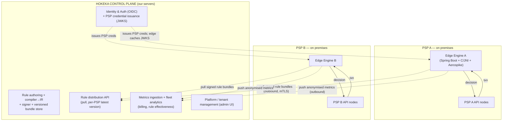
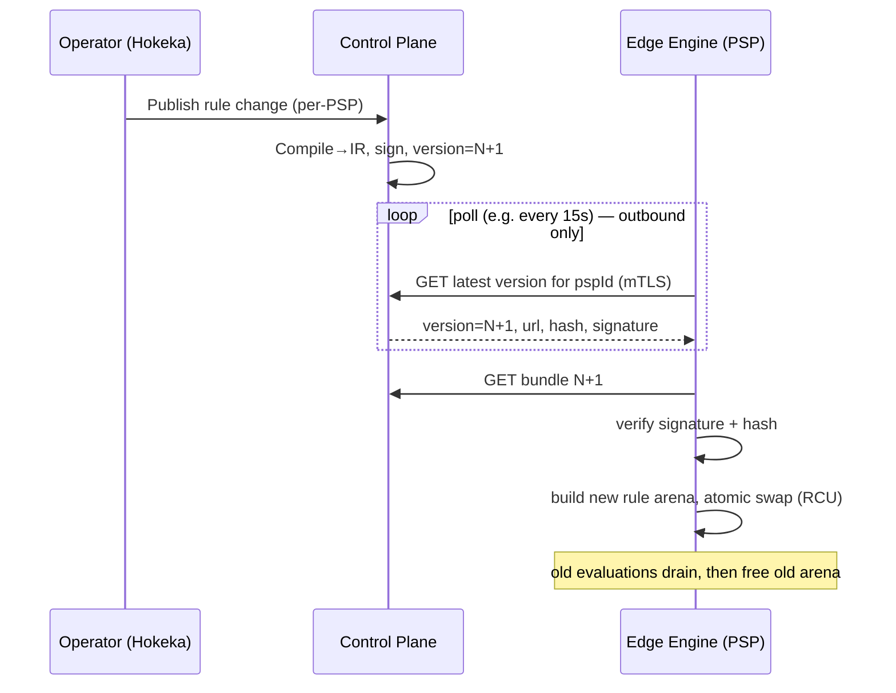
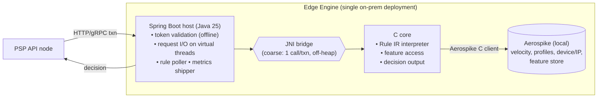
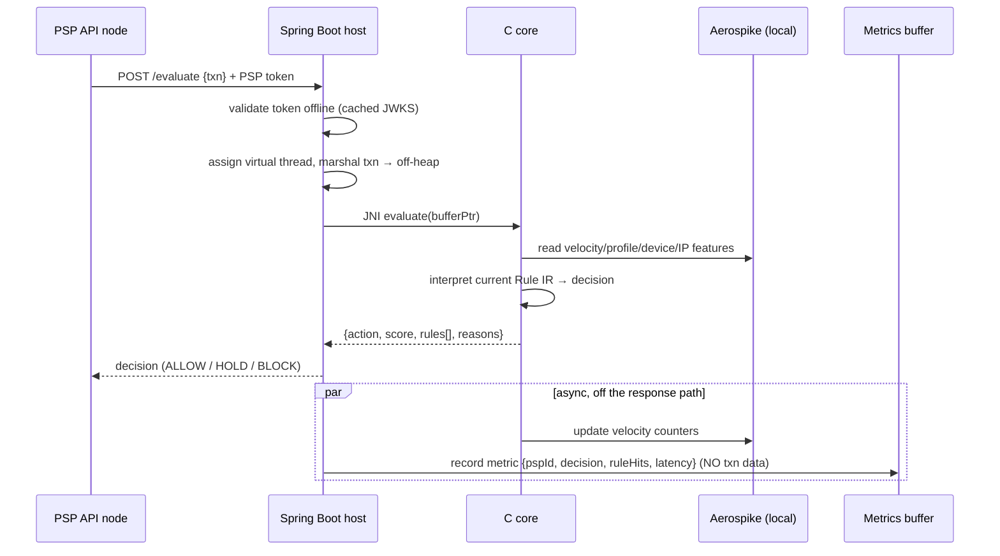

# Hokeka Edge-Distributed AML Platform — Architecture & Implementation Plan

_Status: design proposal. Target: split the current central monolith into a **control plane**
(Hokeka-hosted) and a **data plane** (an evaluation engine deployed on each PSP's own premises)._

---

## 1. Goals & non-negotiables

| # | Requirement | Consequence for the design |
|---|-------------|----------------------------|
| G1 | PSP transaction & customer data **never leaves the PSP premises** | Evaluation runs on-prem; only rules come down, only anonymised metrics go up. |
| G2 | Rules are **authored, versioned and managed centrally**; never created at the edge | Edge is a read-only rule *executor*; rules are pulled, signed, verified. |
| G3 | **Authentication is central** (Hokeka), not on PSP/client premises | Central identity/credential issuance; edge validates central-issued tokens **offline**. |
| G4 | Edge engine = **Java Spring Boot host + core logic in C via JNI**; datastore = **Aerospike** | Coarse-grained JNI bridge; C rule-interpreter; Aerospike C client on the hot path. |
| G5 | Transaction result is **relayed back to the calling PSP API node** | Synchronous request/response at the edge, sub-ms–few-ms budget. |
| G6 | Only **per-PSP metrics** (counts, decisions, latencies) — **no transaction data** — reach Hokeka | Privacy-preserving aggregate telemetry, store-and-forward. |
| G7 | **Virtual threads** for throughput & concurrency | I/O on virtual threads; the CPU-bound C kernel on a bounded pool (see §8). |

**Guiding principle:** *rules flow down, aggregates flow up, raw data stays put.*

---

## 2. Topology

**Two independently-scaled planes:**

- **Control plane (Hokeka):** largely the *current* backend, refocused — rule management, auth,
  admin/tenant management, metrics/analytics, and a new **rule distribution** + **signing** service.
- **Data plane (edge):** a new, slim, high-performance engine, one deployment per PSP, behind the
  PSP's firewall. **All edge→central traffic is outbound-only** (edge polls / pushes) so no inbound
  ports need opening on PSP infrastructure — a big win for PSP security sign-off.

---

## 3. Data residency & trust boundaries

| Crosses the boundary? | Direction | Contents |
|---|---|---|
| Rule bundles | central → edge | Rule IR, thresholds, lists (sanctions/PEP refs by hash), config. **Signed.** |
| PSP credentials / JWKS | central → edge | Public keys + credential metadata for **offline** token validation. |
| Metrics | edge → central | Counts, decision breakdown, rule-hit counts, latency percentiles, engine health. **No PII, no txn data.** |
| Transaction & customer data | **never leaves the edge** | Stored only in the PSP's local Aerospike; evaluated in-process. |

This is the crux of the value proposition: Hokeka can run a global rule/intelligence platform and
bill/measure it **without ever holding a PSP's customer or transaction data** — which collapses a
huge amount of the GDPR / data-residency / PCI-DSS / bank-procurement friction.

---

## 4. Authentication model (central issuance, edge offline enforcement)

The tension: "auth is central" **and** "a transaction check must not require a round-trip to
Hokeka" (that would defeat on-prem latency and couple every txn to our uptime). Resolve it by
splitting *credential issuance* (central) from *credential verification* (edge, offline):

- **Admin / rule-management / platform auth** → 100% central. Operators log into Hokeka (OIDC/SSO)
  to author rules and manage tenants. Nothing sensitive is administrable at the edge.
- **PSP API-node → edge authentication** → the edge validates a **central-issued, short-lived JWT**
  (or signed API key) presented by the PSP's API node. The edge verifies the signature **offline**
  using Hokeka's public keys (JWKS), refreshed periodically and **cached** so it survives central
  downtime. Hokeka is the issuer/authority; the edge is a stateless verifier.
- **Edge → control plane** → **mTLS** with a per-edge client certificate issued at provisioning;
  certificate identifies the PSP/edge instance for rule-scoping and metrics attribution.
- **Revocation** → short token TTLs + a revocation list distributed with rule bundles; an edge can
  be remotely quarantined (control plane refuses its metrics / flags it) even though it runs offline.

Net: identity lives on Hokeka; the edge enforces it locally without phoning home per transaction.

---

## 5. Rule lifecycle & distribution

**Rules are data, not code.** Do **not** ship C source or compiled `.so` per rule change — that
would be a security and operational nightmare (native code from the network = RCE surface; per-PSP
recompilation; signing every native artifact). Instead:

1. **Author** centrally (the existing dynamic-rule catalog + per-PSP copies already built).
2. **Compile** each PSP's active rule set into a compact, versioned **Rule IR** — an expression /
   decision-tree bytecode the C engine interprets (operators, field refs, thresholds, list refs,
   actions). This reuses the existing `RuleDefinition` semantics (SpEL/dynamic-rule conditions map
   cleanly to an IR).
3. **Sign** the bundle (Ed25519) and stamp it `{pspId, version, hash}`.
4. **Publish** to the distribution store; expose "latest version for pspId".
5. **Pull** at the edge: on startup + on a poll/long-poll. "Always pulled once new changes are done"
   → edge compares its running version to `latest`; if newer, downloads, **verifies signature +
   hash**, and does an **atomic hot-swap** (see §6, RCU) with zero dropped in-flight evaluations.
6. **Attest**: edge reports its running `{version, hash}` in metrics; control plane detects drift or
   tampering (an edge running an unsigned/old bundle is flagged).

**No authoring at the edge** — the edge has no write path into the rule store; it is pull-only and
signature-gated, so a compromised PSP host cannot forge rules.

---

## 6. Edge engine internals

**Responsibilities split:**

- **Java Spring Boot host** — everything *around* the compute: inbound API, offline token
  validation, request lifecycle on **virtual threads**, rule polling/verification/hot-swap
  orchestration, the store-and-forward metrics buffer, health/observability. Java is good at all of
  this and lets us reuse a lot of the existing codebase.
- **C core** — the hot evaluation kernel: interpret the current Rule IR over a transaction, reading
  features (velocity counters, profiles, device/IP reputation) straight from Aerospike via the
  **Aerospike C client** (keeps the hot path native end-to-end — no JNI hop for DB access), and emit
  a decision struct `{action, score, triggered_rule_ids[], reasons[]}`.

**JNI bridge — the rules that keep it fast and safe:**

- **Coarse-grained:** exactly **one JNI crossing per transaction**. Marshal the whole transaction as
  a single flat struct via a **direct `ByteBuffer`** (off-heap, zero-copy) in, one decision struct
  out. Never make per-field JNI calls — crossings are ~tens of ns each and chatty bridges destroy
  the C advantage.
- **Rule arena + RCU hot-swap:** the C side loads a rule version into an immutable **arena**
  (read-only during evaluation). A new version builds a new arena; an **atomic pointer swap**
  publishes it; in-flight evaluations finish on the old arena, which is freed once drained
  (read-copy-update). No locks on the read/eval path.
- **Memory safety is the #1 risk:** a bug in the C core crashes the whole JVM. Mitigations: a narrow,
  well-specified ABI; all inputs bounds-checked at the boundary; build with AddressSanitizer +
  UBSan in CI; fuzz the IR interpreter (libFuzzer) against malformed bundles/transactions; no
  dynamic allocation on the per-txn path (arena/stack only).

---

## 7. Transaction flow (edge, end-to-end)

Response path is: token check → marshal → 1 JNI call (feature reads + eval) → return. Counter
updates and metric emission happen **asynchronously off the response path** so they never add to the
decision latency the PSP sees.

---

## 8. Concurrency & virtual threads (the important nuance)

Reuse the principle already adopted in this codebase: **virtual threads for I/O, bounded platform
pool for CPU-bound work.**

- **Inbound API + all I/O** (token validation, Aerospike async ops, rule polling, metrics shipping)
  → **virtual-thread-per-request**. Cheap, massive concurrency, parks while blocked.
- **The C evaluation kernel is CPU-bound.** Two caveats to design around:
  1. **JNI pins a virtual thread to its carrier** for the duration of the native call. That's fine
     for a *short compute* call (it's not blocking I/O), but if thousands run at once they'd pin all
     carriers. So run the **C `evaluate()` on a bounded executor sized to ~CPU cores** (a
     `Semaphore`/bounded pool — same pattern as the existing `AsyncConfig`/`UltraHighThroughputConfig`),
     giving natural backpressure, while the surrounding request stays on a virtual thread.
  2. **The Aerospike C client should be async / event-loop** inside the C call, or feature reads
     batched, so the native call is compute-dominant, not blocked on DB round-trips.
- **Backpressure & admission control** at the host (max in-flight, queue with `CallerRuns`-style
  shedding) so a burst degrades latency gracefully instead of OOM/pinning.

> Honest note: virtual threads shine on the I/O-heavy periphery here. The core win for raw
> per-transaction speed is the C kernel + off-heap marshalling + Aerospike locality — **benchmark
> the C kernel against an optimised Java kernel before committing** (see §12); JNI marshalling
> overhead can eat a surprising fraction of C's advantage if the payload is large.

---

## 9. Metrics telemetry (privacy-preserving)

- **Emitted at edge, aggregated locally:** per-PSP rolling counters — total evaluated, decisions
  (allow/hold/block), per-rule hit counts, score distribution buckets, latency p50/p95/p99, engine
  health, running rule version/hash. **No PAN, no customer id, no amount, no transaction record.**
- **Store-and-forward:** buffered on-disk at the edge, batched, signed, shipped outbound to the
  control plane; survives central downtime and retries.
- **Control plane use:** billing (per-PSP volume), **cross-PSP rule effectiveness** (which rules
  fire / are noisy across the fleet — without seeing any PII), SLA dashboards, anomaly detection on
  an edge's own metrics.
- **Privacy hardening:** enforce a strict allow-list schema on the metric payload (reject anything
  not on it), and consider k-anonymity/aggregation windows so low-volume buckets can't leak.

---

## 10. Failure modes & resilience

| Failure | Behaviour |
|---|---|
| Control plane unreachable | Edge keeps evaluating on **last-known-good signed rule bundle** (cached); token validation uses cached JWKS; metrics buffer to disk and drain later. **No dependency on Hokeka for the live decision path.** |
| Rule bundle unverifiable / corrupt | Reject; stay on previous version; raise a health alert via metrics. |
| Aerospike (local) down/degraded | **Fail-closed** (HOLD/REVIEW), never fail-open — consistent with the existing platform principle. |
| C core fault | Guarded ABI + watchdog; a crash restarts the host process; host readiness gate keeps the PSP API node from routing to an unhealthy edge. |
| Rule hot-swap mid-traffic | RCU: in-flight evaluations finish on old arena; new traffic uses new arena; zero drops. |
| Clock skew / token expiry at edge | Small leeway window + JWKS caching; central issues reasonable TTLs. |

---

## 11. Security summary

- Edge→central: **mTLS**, outbound-only, per-edge client cert.
- Rule bundles: **Ed25519 signed**, hash-pinned, verified before swap; unsigned/modified → rejected.
- PSP tokens: central-issued, **offline-verified** at edge via cached JWKS; short TTL + revocation
  list in bundles.
- Edge is **pull/verify only** — no write path to rules, so a compromised PSP host can't forge or
  alter rules.
- C boundary hardened (bounds checks, ASan/UBSan/fuzz) — treat every byte from the network/txn as
  hostile.
- Attestation: edge reports running version+hash; drift/tamper detected centrally.

---

## 12. Migration from the current monolith

The current Spring Boot backend already contains most of the **control-plane** capability (dynamic
per-PSP rules, auth, tenant management, metrics). The work is to (a) refocus it as the control plane
and (b) build the new edge data plane.

**Phase 0 — De-risk (2–4 wks).** Define the **Rule IR** and prove the compile path from the existing
`RuleDefinition` catalog. Build a prototype C interpreter for a handful of rule types. **Benchmark C
kernel vs optimised Java kernel** on representative rules — decide C-vs-Java on evidence, not
assumption (a Java kernel with the existing virtual-thread + off-heap work may already hit target
TPS at far lower complexity/risk).

**Phase 1 — Control plane.** Add: Rule-IR compiler, bundle **signer**, versioned bundle store, the
**distribution API** (latest-version + download, mTLS), PSP **credential issuance + JWKS**, and the
**metrics ingestion** endpoint + fleet analytics. Mostly additive to today's backend.

**Phase 2 — Edge engine.** Slim Spring Boot host (token validation, rule poller + verify + hot-swap,
transaction API, metrics shipper) + C core (IR interpreter + Aerospike C client) + JNI bridge +
local Aerospike + store-and-forward buffer. Package as a deployable appliance (container/VM image).

**Phase 3 — Pilot.** One friendly PSP; shadow-mode (edge evaluates, logs, doesn't enforce) →
compare against central; then enforce. Validate data-residency claims with their compliance team.

**Phase 4 — Fleet.** Onboarding tooling, remote update/rollback of edge software, observability,
runbooks, SLAs.

---

## 13. Component inventory (work breakdown)

**Control plane (extend current backend):**
- Rule-IR compiler (`RuleDefinition` → IR) + validator
- Bundle signer + versioned store + distribution API (per-PSP latest/download, mTLS)
- PSP credential issuance + JWKS endpoint + revocation
- Metrics ingestion API + fleet analytics/billing + effectiveness reporting
- Edge fleet registry (which edge runs which version, health, attestation)

**Edge engine (new):**
- Spring Boot host: transaction API, offline token validator, rule poller/verifier/hot-swap
  orchestrator, metrics aggregator + store-and-forward shipper, health/observability
- C core: Rule IR interpreter, feature access via Aerospike C client, decision emitter, RCU arena mgmt
- JNI bridge: off-heap marshalling, narrow ABI, error propagation
- Local Aerospike deployment + schema (velocity, profiles, device/IP, feature store)
- Packaging: appliance image, config, provisioning (cert + first bundle)

**Cross-cutting:**
- Rule IR spec + versioning/compat policy
- Security: signing keys/rotation, mTLS PKI, threat model
- CI: ASan/UBSan/fuzz for C, cross-compile matrix, edge integration tests
- Observability across the fleet without PII

---

## 14. Key risks & my recommendation

| Risk | Note |
|---|---|
| **C/JNI complexity & memory safety** | A native bug crashes the JVM and runs inside the PSP's trust boundary. Highest-effort, highest-risk piece. |
| **Is C worth it?** | The honest question. This codebase already invested in virtual threads + off-heap for throughput. **Recommend Phase-0 benchmark**: if an optimised Java kernel hits the TPS/latency SLO, you avoid the entire C/JNI risk surface. If it doesn't, C is justified — and then consider **Rust** over C for the same speed with memory safety (still callable from Java via JNI/Panama), or **Java + the Foreign Function & Memory API (Project Panama)** instead of hand-written JNI for a safer, lower-overhead native bridge. |
| **Rule IR expressiveness** | Must cover today's SpEL/dynamic-rule + per-PSP semantics; version it for forward/back compat. |
| **Edge fleet operations** | Deploying/updating/observing software on N external sites is a real ops discipline — budget for it. |
| **Data-residency legal validation** | Confirm per-jurisdiction that "metrics only" leaving premises satisfies each PSP's/regulator's rules. |

**My recommendation:** commit to the *topology* now (control plane + on-prem edge, rules-down /
metrics-up, central auth with offline edge verification, Aerospike local, virtual-thread I/O) — it's
sound and it's the real differentiator. Treat **C/JNI as a Phase-0 hypothesis to be proven by
benchmark**, and keep **Rust-via-JNI** and **Java+Panama** as first-class alternatives so the
"native core" decision is made on measured evidence rather than up front.

---

## 15. Open questions for you

1. **Latency/throughput SLO per edge** (target TPS + p99) — drives the C-vs-Java decision.
2. **Rule IR vs. embedded engine** — build a custom IR, or embed an existing fast rule engine at the
   edge? IR gives full control; embedding is faster to ship.
3. **Edge packaging** — container, VM appliance, or bare-metal install at PSP sites?
4. **How "instant" must rule propagation be?** Poll interval / push — seconds, or is minutes fine?
5. **Sanctions/PEP list distribution** — lists are large and change; ship as part of bundles, or a
   separate signed list-sync channel?
6. **Multi-region control plane** — HA/DR expectations for Hokeka central.
