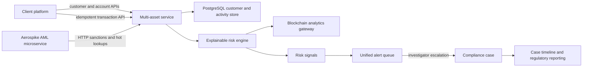

# Multi-Asset AML and Customer 360

> **Status:** Implemented | **Last updated:** July 2026

Hokeka monitors activity across banking, securities, e-money, and crypto under one PSP-scoped customer identity. The implementation keeps raw evidence, explainable signals, unified alerts, and downstream cases connected by stable references.

## Scope

| Asset class | Implemented scenarios |
|---|---|
| Banking | Third-party funding, cross-asset movement, counterparty aggregation |
| Securities | Rapid liquidation, matched orders, low-price/high-value trading, rapid post-funding purchases |
| E-money | 24-hour velocity, structured top-ups, country mismatch, new devices, configurable high-risk merchant categories |
| Prepaid / closed loop | Rapid load-to-redemption, refund velocity, mandatory programme provenance |
| Tokenized fiat / CBDC | Verified issuer provenance, authoritative ledger reference, USD-normalized velocity, cross-border context |
| Crypto | Wallet-provider availability, elevated/high wallet risk, cross-chain movement, missing fiat value, Travel Rule completeness |

The scenario engine is deterministic and explainable. Each signal records a code, severity, score impact, description, and evidence map. Scores map to `ALLOW`, `ALERT`, `REVIEW`, or `BLOCK`.

Securities AML remains distinct from [Market Surveillance](MARKET_SURVEILLANCE.md), which consumes orders, executions, cancellations, reference prices, and market-close context and emits `MARKET_ABUSE` signals.

## End-to-End Flow



Aerospike remains owned by `aml-microservice`. The BACKEND consumes it through HTTP delegation and does not embed a second Aerospike persistence layer. PostgreSQL remains the system of record for Customer 360 entities, transactions, signals, and alert provenance.

## Data Model

- `multi_asset_customers`: PSP-scoped identity, KYC state, and customer risk tier.
- `asset_accounts`: linked bank, brokerage, mobile-money, stored-value, exchange, and wallet accounts.
- `multi_asset_customer_relationships`: PSP-scoped UBO, shareholder, director, signatory, control, and related-customer links.
- `multi_asset_transactions`: normalized cross-asset events and their decision outcome.
- `multi_asset_risk_signals`: immutable scenario evidence for each assessed transaction.
- `alerts`: receives non-`ALLOW` multi-asset decisions with PSP, customer, source type, and idempotent source reference.

Flyway migrations:

- `V151__multi_asset_customer_360.sql`
- `V152__multi_asset_alert_bridge.sql`
- `V153__multi_asset_customer_relationships.sql`
- `V161__multi_domain_signal_taxonomy.sql`
- `V192__separate_tokenized_fiat_asset_class.sql`

Every account, transaction, and signal carries an explicit product domain:

- `BANKING`
- `SECURITIES_AML`
- `SECURITIES_MARKET_SURVEILLANCE`
- `E_MONEY_MOBILE_MONEY`
- `PREPAID_CLOSED_LOOP`
- `VIRTUAL_ASSET`
- `TOKENIZED_FIAT_CBDC`

Signals also carry an explicit family: `AML`, `MARKET_ABUSE`, `SANCTIONS`, `FRAUD`, `CYBER`, or `CRYPTO_EXPOSURE`.

## API

All endpoints are below `/api/v1/multi-asset`, require authentication, and derive the PSP scope from the authenticated user. Client-provided PSP identifiers are not accepted.

| Method | Path | Purpose |
|---|---|---|
| `POST` | `/customers` | Create a PSP-scoped customer identity |
| `GET` | `/customers` | Search and page customer identities |
| `POST` | `/customers/{customerId}/accounts` | Link an asset account |
| `POST` | `/customers/{customerId}/relationships` | Link a UBO, owner, director, signatory, controlling person, or related customer |
| `GET` | `/customers/{customerId}/360` | Return identity, accounts, exposure, activity, signals, and counterparties |
| `POST` | `/transactions` | Idempotently assess and ingest normalized activity |
| `GET` | `/signals` | Page the PSP risk-signal feed |

The application route is `/customer-360`. It uses these APIs for customer creation, account linking, transaction ingestion, exposure summaries, activity, and signals. It does not use fixture or fallback data.

## Provider Contract

Crypto screening uses `BlockchainAnalyticsClient`, a vendor-neutral adapter that expects a normalized gateway response:

```json
{
  "riskScore": 82,
  "categories": ["MIXER_EXPOSURE"],
  "reference": "provider-assessment-id"
}
```

Configuration:

```properties
blockchain.analytics.enabled=true
blockchain.analytics.provider=YOUR_PROVIDER
blockchain.analytics.base-url=https://provider-gateway.example
blockchain.analytics.screening-path=/v1/wallets/screen
blockchain.analytics.api-key=${BLOCKCHAIN_ANALYTICS_API_KEY}
blockchain.analytics.timeout=3s
```

Disabled, failed, malformed, or timed-out provider responses produce `CRYPTO_SCREENING_UNAVAILABLE`; they never produce a clean wallet decision.

## Jurisdiction Configuration

The dedicated [Virtual Asset Compliance](VIRTUAL_ASSET_COMPLIANCE.md) workflow stores effective-dated Travel Rule policies by PSP and jurisdiction. It validates thresholds, required payload fields, identity checks, accepted protocols, and retention at transaction time. `multiasset.crypto.travel-rule-threshold-usd` remains an early-ingestion risk signal only; it is not the authoritative legal policy and cannot mark a transfer transmitted or acknowledged.

Other scenario configuration:

```properties
multiasset.emoney.daily-threshold=2000
multiasset.emoney.high-risk-merchant-categories=GAMBLING,CRYPTO_OTC,ADULT
multiasset.prepaid.rapid-redemption-hours=2
multiasset.prepaid.refund-count-threshold=3
multiasset.tokenized-fiat.daily-threshold-usd=10000
multiasset.securities.penny-stock-price-threshold=5
multiasset.crypto.travel-rule-threshold-usd=1000
```

## Operational Guarantees

- Transaction ingestion is idempotent per PSP and external transaction ID.
- Customer, account, signal, alert, and 360 reads are PSP scoped.
- Account asset classes must match the ingested transaction asset class.
- External wallet screening fails closed.
- Tokenized fiat is a distinct asset class and is never sent through virtual-asset wallet screening or Travel Rule handling.
- Missing prepaid programme evidence or tokenized-fiat issuer/ledger provenance creates an explainable review signal.
- Non-`ALLOW` decisions enter the existing alert workflow.
- Escalated alerts preserve PSP context when the existing case workflow creates a case.

Mobile-money events requiring device, SIM, agent, merchant, location, float, or network-level analysis use the dedicated mobile-money API. See [Mobile Money Intelligence](MOBILE_MONEY_INTELLIGENCE.md). It writes the same multi-asset transaction and signal records, then adds durable network evidence, entity risk profiles, unified alerts, record trails, and `MM_001` through `MM_003` reports.

## References

- [FATF Recommendation 16 update, June 2025](https://www.fatf-gafi.org/en/publications/Fatfrecommendations/update-Recommendation-16-payment-transparency-june-2025.html)
- [FATF virtual assets and VASPs](https://www.fatf-gafi.org/en/publications/Fatfrecommendations/Targeted-update-virtual-assets-vasps.html)
- [FinCEN securities SAR guidance](https://www.fincen.gov/resources/statutes-regulations/guidance/guidance-sharing-suspicious-activity-reports-securities)
